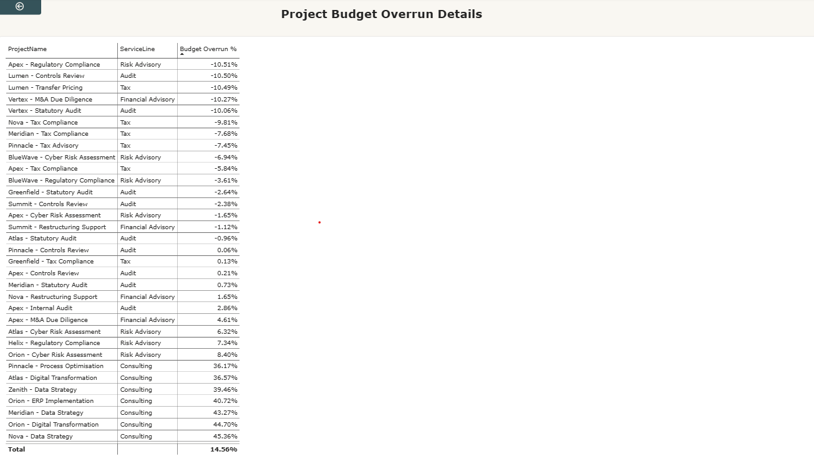

# Consulting Profitability and Utilization Dashboard

## 📊 Project Overview

The **Consulting Profitability and Utilization Dashboard** is a Power BI-based Business Intelligence solution designed to analyze consulting profitability, project performance, budget performance, client revenue, service-line performance, and employee utilization.

The dashboard converts raw business data into interactive KPIs and visual insights, helping management identify cost overruns, profitability gaps, and resource-utilization issues for better data-driven decision-making.

## 🎯 Objectives

- Monitor revenue, cost, profit margin, and employee utilization.
- Identify projects with significant budget overruns.
- Compare budget performance across different service lines.
- Analyze client-wise revenue and profitability.
- Identify under-utilized employees.
- Support better project and resource planning.
- Enable interactive analysis using Service Line and Region filters.

## 📌 Key Dashboard Metrics

- **Total Revenue:** 8.39M
- **Total Cost:** 4.67M
- **Profit Margin:** 44.25%
- **Utilization:** 70.68%

## 🛠️ Tools & Technologies

- **Power BI**
- **Power Query**
- **DAX**
- **Data Modeling**
- **Microsoft Excel**
- **Data Visualization**
- **Business Intelligence**

## 📈 Dashboard Features

- Financial performance analysis
- Revenue and cost analysis
- Profit margin analysis
- Project budget vs. actual analysis
- Client-wise revenue and profitability
- Service-line performance comparison
- Employee utilization analysis
- Region and Service Line filters
- Interactive KPI cards and charts

## 🖼️ Dashboard Preview

### Dashboard Output 1

### Dashboard Output 2

## 💡 Key Insights

- The dashboard provides a centralized view of financial and operational performance.
- It helps identify projects with budget overruns and profitability gaps.
- Employee utilization analysis helps identify under-utilized resources
